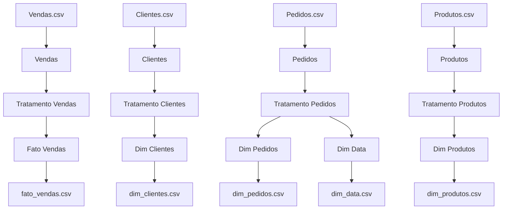

# Bem vindo

## Workflow

# ETL

## Extração

As seguintes tabelas foram extraídas para iniciar o processo ETL:

### Tabela `Vendas.csv`
- **Linhas:** 51,290
- **Colunas:** 6

| Pedido | Cliente | Produto | Valor Venda | Quantidade Venda | Custo Envio |
|--------|---------|---------|-------------|------------------|-------------|

---

### Tabela `Clientes.csv`
- **Linhas:** 1,590
- **Colunas:** 8

| ID Cliente | Nome Cliente | Segmento | Cidade | Estado | País | Mercado | Região |
|------------|--------------|----------|--------|--------|------|---------|--------|

---

### Tabela `Produtos.csv`
- **Linhas:** 10,292
- **Colunas:** 4

| ID Produto | Categoria | SubCategoria | Nome Produto |
|------------|-----------|--------------|--------------|

---

### Tabela `Pedidos.csv`
- **Linhas:** 25,036
- **Colunas:** 7

| Local Pedido | Ano | ID Pedido | Data Pedido | Data Envio | Modo Envio | Prioridade Pedido |
|--------------|-----|-----------|-------------|------------|------------|------------------|

---

## Checagem e Processamento

### Duplicidades Encontradas

- **Produtos.csv**
  - Encontrados **1,938 produtos (18.8% do total)** com mesmo nome, mas IDs diferentes.
  - Exemplo:
  
    | ID Produto         | Categoria   | SubCategoria | Nome Produto                                   |
    |--------------------|-------------|--------------|------------------------------------------------|
    | TEC-AC-10003033    | Tecnologia  | Accessories  | Plantronics CS510 - Over-the-Head monaural ... |

  - Apenas **2 produtos** estavam presentes em subcategorias diferentes.
  - Produtos com nomes mais recorrentes:
  
    | nome_produto                      | Quantidade |
    |-----------------------------------|------------|
    | Staples                           | 45         |
    | Stockwell Paper Clips, Assorted   | 16         |
    | ...                               | ...        |

- **Clientes.csv**
  - Muitos nomes repetidos, porém com cidade/estado/região diferentes.
  - Risco de confusão entre homônimos ou perfis distintos ao fazer merges apenas pelo nome.

- **Pedidos.csv**
  - **3,518 registros** têm o mesmo `pedido_num`, indicando duplicidade significativa.
  - Exemplo:

    | Local Pedido | Ano | ID Pedido | Data Pedido | ... |
    |--------------|-----|-----------|-------------|-----|
    | CA           | 2012| 124891    | 31/07/2012  | ... |
    | CA           | 2012| 124891    | 31/07/2012  | ... |

- **Vendas.csv**
  - Após padronização de IDs de produtos, **32,281 vendas (~63%)** apresentavam IDs diferentes para o mesmo nome de produto.

---

## Transformação

Principais etapas de transformação realizadas:

### 1. Tratamentos Gerais
- Conversão de datas na tabela de pedidos.
- Renomeação de colunas para padronização.
- Conversão de tipos (de texto para numérico) em vendas.
- Criação das colunas `valor_unit` (vendas) e `id_pedido` (pedidos).

### 2. Tabela Dimensional de Produtos (`dim_produtos`)
- Unificação de IDs para produtos com nomes repetidos (`10,292` → `3,660`).
- Criação de surrogate key `sk_produto`.
- Checagem cruzada entre produto e vendas.

### 3. Tabela Dimensional de Clientes (`dim_clientes`)
- Criação da surrogate key `sk_cliente`.

### 4. Tabela Dimensional de Pedidos (`dim_pedidos`)
- Criação da surrogate key `sk_pedido`.

### 5. Tabela Dimensional de Datas (`dim_data`)
- Criação a partir de datas de pedido e envio.
- Associação com a tabela de pedidos.

### 6. Organização das Colunas
- Remoção de colunas temporárias.
- Reordenação das colunas finais.
- Geração da tabela fato final `fato_vendas`.

### 7. Análise de Outliers
- **valor_venda:** 5,655 registros identificados como outliers.
- **custo_envio:** 5,022 registros identificados como outliers.
  - Outliers podem distorcer análises estatísticas e indicar oportunidades de investigação e ajuste de dados.

---

## Observações Relevantes

- O tratamento de duplicidades foi essencial para garantir a integridade das dimensões (clientes, produtos, pedidos).
- A unificação de IDs para produtos com mesmo nome resultou em redução expressiva na cardinalidade dessa dimensão.
- A identificação de outliers contribuiu para maior qualidade e confiabilidade dos dados.
- O processo de padronização e geração de surrogate keys facilita o relacionamento e indexação entre as tabelas do Data Warehouse.

